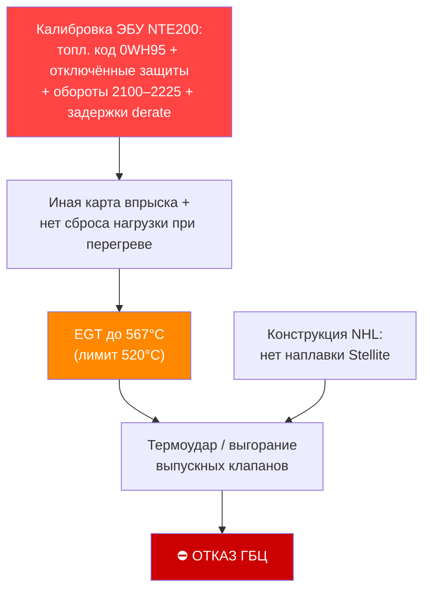
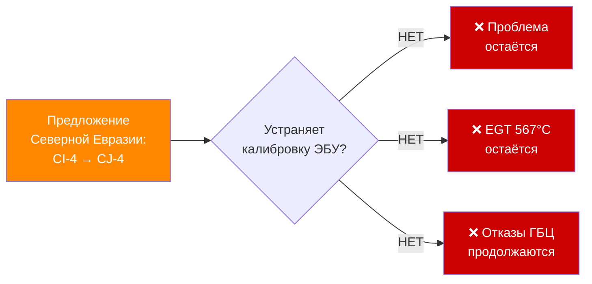
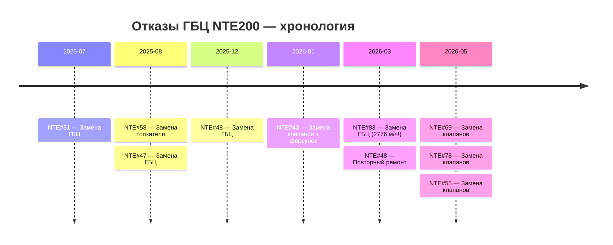

> [!map] Навигация по документу
> [[#Суть проблемы за 30 секунд]] · [[#Механизм отказа]] · [[#Матрица доказательств]] · [[#Данные ЭБУ]] · [[#Анализ масел]] · [[#Анализ топлива]] · [[#Северная Евразия — опровержение]] · [[#Хронология ремонтов]] · [[#Действия]]

---

## Суть проблемы за 30 секунд

> [!danger] TL;DR — Коренная причина установлена
> **Калибровка ЭБУ NTE200** отличается от 730E-DC кластером параметров: **иной топливный код `0WH95`** (карта впрыска), **отключённый дерейт по T масла** (`C_EPD_OT_RPM_Drt_En`=0), задержки derate 43–51 с, **повышенные обороты** (2100→2225 vs 1990) и droop 20 %.
> Итог: высокая EGT без сброса нагрузки → EGT до 567°C (лимит 520°C) → выгорание выпускных клапанов.
> **Решение: перекалибровать ЭБУ под профиль 730E (топливный код + включить защиты + снизить обороты).**

> [!warning] Исправление от 2026-06-26
> Прежняя редакция называла коренной причиной «TIB = Thermal Imbalance = 200%». По **аутентичному экспорту Calterm** (КАМСС, [[Calibration_Compare_730E_vs_NTE200 (Calterm)]]) установлено: **TIB = Trip Information Base** (учёт рейса/расхода), параметр `C_TIB_Fuel_Adjust_Upper_Limit` относится к учёту расхода (FCR) и **на впрыск не влияет**. Тезис «TIB → переобогащение» снят; коренной причиной остаётся **кластер калибровки** (топливный код + сниженные защиты + обороты).

| Параметр | Значение |
|----------|----------|
| Объект | Полюс Магадан (золотодобыча, Магаданская обл.) |
| Техника | БЕЛАЗ-7513 NTE200, 220 т |
| Двигатель | Cummins QSK50 MCRS, V16, 2500 л.с. |
| Система впрыска | MCRS (Modular Common Rail System) |
| Tier | Tier 2 (без DPF, без EGR) |
| Отказы | **30 ремонтных событий, 24+ ед.** |
| Симптом | Выгорание выпускных клапанов |
| Контрольная группа | 730E-DC (тот же двигатель, тот же объект) |
| Отказы 730E-DC | **0** — ключевое |

---

## Механизм отказа



---

## Матрица доказательств

| # | Доказательство | Источник | Вес | Статус |
|---|---------------|---------|-----|--------|
| 1 | Иной топливный код 0WH95 (карта впрыска) + отключён дерейт по T масла | Calterm-экспорт | 🔴 Ключевое | ✅ Подтверждено |
| 2 | EGT Cyl2=567°C, Cyl6=567°C (лимит 520°C) | DML NTE#82 | 🔴 Ключевое | ✅ Подтверждено |
| 3 | ~15 параметров калибровки ЭБУ отличаются | Calterm-экспорт | 🟠 Важное | ✅ Подтверждено |
| 4 | Повышенные обороты/droop + задержки derate 43–51 с | Calterm-экспорт | 🟠 Важное | ✅ Подтверждено |
| 5 | 730E-DC: 0 отказов ГБЦ (контроль) | Данные парка | 🔴 Ключевое | ✅ Подтверждено |
| 6 | NTE#83 отказ при 2776 м/ч (новая машина) | Тех.отчёт | 🟠 Важное | ✅ Исключает износ |
| 7 | Сера в топливе ≤6,2 мг/кг | Паспорта топлива | 🟢 Исключает | ✅ Топливо не причина |
| 8 | CI-4 — правильное масло для QSK50 без DPF | Cummins 378-005 | 🟢 Подтверждает | ✅ Масло не причина |

> [!check] Вывод по доказательной базе
> 3 ключевых доказательства + 2 исключающих фактора. Уровень уверенности: **высокий**.
> Альтернативные гипотезы (масло, топливо) — опровергнуты данными.

---

## Данные ЭБУ

### Сравнение параметров NTE200 vs 730E-DC

```
Топливный код:        NTE200 = 0WH95    |  730E = FC0BU52  ← карта впрыска
C_EPD_OT_RPM_Drt_En:  NTE200 = 0 (выкл) |  730E = 1 (вкл)  ← КРИТИЧНО
Задержки derate:      NTE200 = 51/43 с  |  730E = 0/0 с
C_ABS_Max_Acctr_Speed:NTE200 = 2100 rpm |  730E = 1990 rpm (до 2225 в поз. 2/3)
C_ABS_DroopMax:       NTE200 = 20%      |  730E = 0%
OPTION_NUM_DO:        NTE200 = 61042    |  730E = 6765
C_TIB_Fuel_Adjust_Upper_Limit (учёт расхода, НЕ впрыск): 200% | 100%
```

> [!warning] Топливный код и профиль
> Топливный код `0WH95` (NTE200) vs `FC0BU52` (730E) — **разные карты впрыска** (давление рампы, фазы, дымовой ограничитель). DO_Option = 61042 vs 6765 — разные калибровочные профили.
> Возможно, профиль NTE200 не предназначен для карьерного цикла нагрузки.
> **Открытый вопрос:** [[#Вопросы требующие ответа Cummins|→ запрос в Cummins]]

### Температуры выхлопных газов (DML NTE#82)

| Цилиндр | EGT °C | Норма | Статус | Δ от нормы |
|---------|--------|-------|--------|-----------|
| Cyl1 | ~480 | ≤520 | ✅ | — |
| Cyl2 | **567** | ≤520 | ❌ | **+47°C** |
| Cyl6 | **567** | ≤520 | ❌ | **+47°C** |
| Cyl11 | ~98 | — | ⚠️ | Датчик неисправен |
| Остальные | 450–510 | ≤520 | ✅ | — |

> [!bug] Датчик EGT Cyl11
> Средняя EGT = ~98°C при норме 450–520°C. Датчик выдаёт некорректные данные.
> → Заменить датчик перед следующим DML.

### Данные DML — файлы

| Файл | Машина | Условия | Использование |
|------|--------|---------|--------------|
| `_Данные/DML NTE200/DML_82_bez_porody.csv` | NTE#82 | Без нагрузки | Анализ EGT |
| `_Данные/DML NTE200/DML_82_s_porodoy.csv` | NTE#82 | С породой | Анализ EGT |
| `_Данные/DML NTE200/DML-20260608-NTE200#88.csv` | NTE#88 | Рейс | Сравнение |
| `_Данные/DML NTE200/DML-NTE200#82 after repair.csv` | NTE#82 | После рем. | Контроль |

→ [[Анализ DML]] — методология и полный список файлов

---

## Анализ масел

### Позиция Cummins (Bulletin 5407411, раздел 378-005)

> [!quote] Cummins Bulletin 5407411, раздел 378-005
> *«Там, где содержание серы в топливе выше 15 промилле, и не используется очистка отработавших газов, **не используйте масла стандартов CES 20081, CES 20086, CES 20087** [...] Для такого топлива рекомендуется использовать масла по стандарту **CES 20078**»*

### Таблица допуска масел для QSK50

| Масло | Стандарт | QSK50 без DPF | Ограничение |
|-------|---------|----------------|-------------|
| CI-4 Plus | CES 20078 | ✅ Разрешено | Нет |
| CJ-4 | CES 20081 | ⚠️ Условно | Только при сере <15 ppm |
| CK-4 | CES 20086 | ⚠️ Условно | Только при сере <15 ppm |

> [!success] Вывод по маслу
> CI-4 — правильный выбор для QSK50 без DPF. Масло одинаково на NTE200 и 730E-DC — **не является дифференцирующим фактором**.

### Контрольные пределы масла (378-013)

| Параметр | Критическое значение | Действие |
|----------|---------------------|---------|
| Вязкость (100°C) | 12.5–16.3 cSt | Вне диапазона → замена |
| Сажа | ≤5% | Выше → проверить форсунки |
| TBN | ≥2.5 мг КОН/г | Ниже → замена немедленно |
| Разбавление топливом | ≤5% | Выше → диагностика |
| Вода | <0.1% | Выше → проверить ОЖ |

→ [[_Данные/Масло/_Индекс|Анализы масла — данные]]

---

## Анализ топлива

### Сводка по 25 паспортам (январь–июнь 2026)

| Параметр | Значение |
|----------|----------|
| Лаборатория | ООО «Авиатек», свид. №2401 |
| Поставщик | ООО «Магаданнефто», Портовое шоссе 201 |
| Стандарт | ТР ТС 013/2011 + ГОСТ 32511-2013 |
| Классы | ДТ-З (зимнее), ДТ-Л (летнее), ДТ-А (арктическое) |
| Экологический класс | **Е5 (≤10 мг/кг серы)** — все паспорта |

### Содержание серы

| Топливо | Среднее мг/кг | Максимум мг/кг | Порог Cummins | Статус |
|---------|--------------|---------------|---------------|--------|
| ДТ-З (зима) | **5,5** | 10,0 | 15 мг/кг | ✅ |
| ДТ-Л (лето) | **9,4** | 10,0 | 15 мг/кг | ✅ |
| **Итого** | **6,7** | **10,0** | **15** | **✅ В 2,4× ниже** |

> [!success] Вывод по топливу
> Сера в 2,4 раза ниже порога Cummins. **Топливо полностью исключено как причина отказов ГБЦ.**

> [!warning] Нарушение — паспорт №246-А (ДТ-А, ТАЙМЫР)
> Декларация ЕАЭС №RU-Д-ПЛ.РЖ7.Д-66865/22 **истекла 24.10.2025**.
> Топливо использовано **25–28 декабря 2025** — через 2 месяца после истечения.
> **Нарушение ТР ТС 013/2011.** → Требует устранения (см. [[#Действия]])

### Производители топлива

| Период | Производитель | Дистрибьютор |
|--------|-------------|-------------|
| Зима 2026 (янв–март) | РН-Комсомольский НПЗ | ООО Трансбункер-Ванино |
| Зима 2026 (март) | РН-Инвест (Тюменский НПЗ) | — |
| Лето 2026 (апр–июнь) | Газпром нефтехим Салават | Трансбункер-Приморье |
| Лето 2026 | АО ННК-Хабаровский НПЗ | Востокбункер |
| Дек 2025 | АО ТАЙМЫР (Нижнекамск) | ООО Магаданнефто |

---

## Северная Евразия — опровержение

### Предложение: перевод CI-4 → CJ-4 (тест 500 м/ч)

> [!danger] Это отвлечение от коренной причины
> 1. Масло **одинаково** на NTE200 и 730E-DC — не дифференцирующий фактор
> 2. Топливо Е5 (≤10 мг/кг) — переход на CJ-4 не требуется даже по Cummins
> 3. CJ-4 создан для DPF — на QSK50 Tier 2 DPF отсутствует — нет преимуществ
> 4. CJ-4 имеет **меньший начальный TBN** — хуже при высоких тепловых нагрузках
> 5. Реальная причина (калибровка ЭБУ) останется нетронутой

> [!quote] Cummins 378-003 — контраргумент
> *«Более высокий номер CES не означает лучшее масло»*



---

## Хронология ремонтов



| Маш. № | Дата | Моточасы | Операция | Примечание |
|--------|------|---------|---------|-----------|
| 51 | 17.07.2025 | — | Замена ГБЦ | |
| 58 | 10.08.2025 | — | Замена толкателя | |
| 47 | 11.08.2025 | — | Замена ГБЦ | |
| 48 | 17.12.2025 | — | Замена ГБЦ | |
| 43 | 21.01.2026 | — | Замена клапанов + форсунок | |
| **83** | **~03.2026** | **2776 м/ч** | **Замена ГБЦ** | **⚠️ Новая машина!** |
| 48 | 31.03.2026 | — | Повторный ремонт | Рецидив |
| 55 | 13.05.2026 | — | Замена клапанов | |
| 69 | 25.05.2026 | — | Замена клапанов | |
| 78 | 20.05.2026 | — | Замена клапанов | |

> [!warning] NTE#83 при 2776 м/ч — системный индикатор
> Отказ на практически новой машине исключает износ как причину.
> Прямое указание на системную проблему калибровки ЭБУ с первых часов работы.

---

## Нормативная база

| Стандарт | Класс | Параметр | Значение |
|----------|-------|---------|---------|
| ТР ТС 013/2011 | Е5 | Сера max | ≤10 мг/кг |
| ГОСТ 32511-2013 | — | Сера max | ≤10 мг/кг |
| Cummins CES 20078 | CI-4 Plus | Стандарт масла QSK50 | Без DPF |
| Cummins 378-007 | — | Вязкость при T>-20°C | **15W-40** обязательно |
| Cummins 378-007 | — | Вязкость при T<-20°C | 0W-40 / 5W-40 |
| Cummins 378-007 | — | 20W-40, 20W-50 | **ЗАПРЕЩЕНЫ** для QSK |

---

## Действия

### Приоритет 1 — Срочно 🔴

- [ ] **Перекалибровать ЭБУ NTE200** под профиль 730E: топливный код/карта впрыска как у 730E, включить `C_EPD_OT_RPM_Drt_En` и триггеры `C_DO_01/07/08`, убрать задержки derate, снизить max обороты до 1990 #действие/срочно
- [ ] **Провести DML** на всём парке NTE200 — подтвердить снижение EGT после калибровки #действие/срочно
- [ ] **Заменить датчик EGT** цилиндра 11 на NTE#82 перед следующим DML #действие/срочно

### Приоритет 2 — Краткосрочно 🟠

- [ ] **Запрос в Cummins**: подтверждение правильности DO_Option 61042 для NTE200 #действие/важно
- [ ] **Базовые пробы масла** на всём парке NTE200 — до и после перекалибровки #действие/важно
- [ ] **Архивные пробы масла**: анализ на сажу (сравнить NTE200 vs 730E) #действие/важно

### Приоритет 3 — Средне- и долгосрочно 🟡

- [ ] **Претензия к поставщику NTE200** по калибровке ЭБУ #действие/плановое
- [ ] **Паспорта топлива**: обязать Северную Евразию предоставлять на каждую партию #действие/плановое
- [ ] **Устранить нарушение**: арктический дизель с истёкшей декларацией ЕАЭС #действие/плановое
- [ ] **Мониторинг EGT** в реальном времени — раннее предупреждение по парку #действие/плановое

---

## Вопросы требующие ответа Cummins

> [!question] Открытые вопросы
> 1. Почему DO_Option = 61042 назначен для NTE200 при карьерном цикле нагрузки?
> 2. Чем различаются топливные коды `0WH95` (NTE200) и `FC0BU52` (730E) — рампа давления, фазы впрыска, дымовой ограничитель, карта наддува?
> 3. Почему на NTE200 отключён дерейт по T масла (`C_EPD_OT_RPM_Drt_En`=0) и триггеры перегрева `C_DO_01/07/08` — заводская ошибка или намеренный профиль?
> 4. Есть ли сервисный бюллетень по тепловой защите/оборотам для карьерных приложений QSK50?

---

## Контакты и ответственные

| Роль | Организация |
|------|------------|
| Оператор | Полюс Магадан |
| Подрядчик ТО | Северная Евразия |
| Производитель двигателя | Cummins / CCEC |
| Производитель техники | БЕЛАЗ |
| Лаборатория топлива | ООО «Авиатек» (свид. №2401) |
| Поставщик топлива | ООО «Магаданнефто» |

---

## Связанные заметки

- [[QSK50 MCRS — техническое описание]]
- [[БЕЛАЗ-7513 NTE200 — спецификации]]
- [[730E-DC — контрольная группа]]
- [[Cummins ECM калибровки — параметры]]
- [[Программа перехода масла CI-4 — CJ-4 (отклонено)]]
- [[Паспорта качества топлива 2026]]
- [[DML анализ — NTE200 #82]]
- [[Анализ ECM]]
- [[Анализ DML]]
- [[Износ клапанов ГБЦ QSK50]]

---

*Последнее обновление: 2026-06-21 | Статус: активное расследование | Уверенность: высокая*
