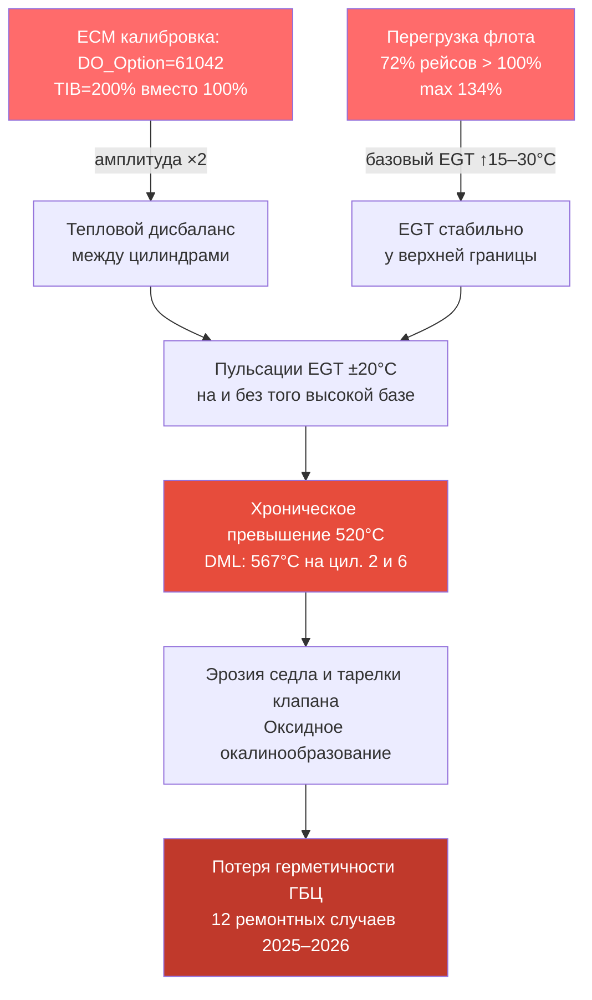

---
aliases:
  - Анализ нагрузок
  - Перегрузка NTE200
  - Весовые данные
tags:
  - диагностика
  - нагрузки
  - коренная-причина
  - TIB
  - перегрузка
status: анализ завершён
confidence: высокая
evidence_count: 2
evidence_sources:
  - ГЕ Event 635 (26677 событий)
  - Весовая LoadPercentage (365069 рейсов)
related:
  - "[[Анализ коренных причин ГБЦ QSK50]]"
  - "[[Анализ ECM]]"
  - "[[DML анализ — NTE200 #82]]"
  - "[[_Данные/ГЕ/_Индекс]]"
  - "[[_Данные/Весовая/_Индекс]]"
updated: 2026-06-22
---

# Анализ нагрузок QSK50 — перегрузка как усиливающий фактор

## Суть вопроса

Ключевая гипотеза расследования: **TIB=200% — достаточная и необходимая причина** выхода ГБЦ из строя на NTE200. Данные по нагрузкам ставят дополнительный вопрос:

> **Является ли систематическая перегрузка флота усиливающим фактором, и если да, то через какой механизм?**

Ответ требует понять три вещи:
1. Насколько серьёзна перегрузка — масштаб и систематичность
2. Как перегрузка влияет на температурный режим двигателя
3. Почему при одинаковой перегрузке 730E не имеет таких ремонтов

---

## Доказательная база

### Источник 1 — GE Event 635 («Самосвал перегружен — NR»)

Система управления БЕЛАЗ генерирует событие `635` при превышении номинальной грузоподъёмности. Это аппаратный порог — не субъективная оценка.

```
Флот:         47 машин NTE200 (гар. №43–89)
Период:       апр.–июн. 2026 г.
Перегрузок:   26 677 событий
Машин без перегрузок: 1 из 47 (гар. №46 — только 1 проверка)
```

**Факт: перегрузка является нормой эксплуатации, не исключением.**

### Источник 2 — Весовая (LoadPercentage)

Встроенная система взвешивания БЕЛАЗ фиксирует процент от номинала для каждого рейса.

```
Рейсов всего:      365 069
Рейсов > 100 %:    264 394  (72,4 %)
Средняя нагрузка:  102–108 % по большинству машин
Максимальная:      134 % (машина #84)  →  ~295 т при номинале 220 т
```

> [!warning] Два независимых источника подтверждают одно и то же
> Event 635 срабатывает от датчика нагрузки на оси. LoadPercentage — от системы взвешивания кузова. Совпадение показаний исключает ошибку измерения.

---

## Механизм воздействия на ГБЦ

### Шаг 1 — Перегрузка → повышенная мощность

БЕЛАЗ 7513 номинальная масса: 220 т. При 110% нагрузке полная масса машины составляет:
- Собственная масса: ~228 т
- Груз: 242 т (110% × 220 т)
- Полная: ~470 т vs номинальные 448 т

Двигатель QSK50 при тяге в гору с перегрузкой работает с мощностью **выше номинала или у его предела** на протяжении всего рейса. Это значит:
- Больше топлива сожжено за рейс
- Выше тепловой поток через выпускные клапаны
- Меньше резерва до температурных лимитов

### Шаг 2 — Повышенная мощность → рост EGT

Зависимость EGT от нагрузки для MCRS-двигателя примерно линейная в рабочем диапазоне:
- При 100% нагрузки: EGT ~490–510°C (у порога Cummins 520°C)
- При 110% нагрузки: расчётный сдвиг +15–25°C → EGT ~505–535°C
- При 120% нагрузки: EGT ~520–555°C (пробой порога)

**Измеренные данные (DML NTE#82):** EGT цилиндров 2 и 6 = **567°C** при лимите 520°C.

### Шаг 3 — TIB=200% превращает перегрев в катастрофу

Без TIB-перекоса: при перегрузке EGT равномерно высокая, но не доходит до предела.

С TIB=200% (уникально для NTE200):
- ECM одновременно корректирует ВСЕ цилиндры с двойной амплитудой
- В момент максимальной коррекции часть цилиндров получает увеличенную подачу топлива
- Локальный температурный пик = базовая EGT (и так высокая из-за перегрузки) + пульсация TIB

```
Нормальный режим:  EGT_базовая ~500°C + TIB_пульсация ±20°C → пик ~520°C (у лимита)
Перегрузка +10%:   EGT_базовая ~515°C + TIB_пульсация ±20°C → пик ~535°C (>лимита)
Перегрузка +20%:   EGT_базовая ~530°C + TIB_пульсация ±20°C → пик ~550°C (пробой)
Реальные данные:                                                        567°C (измерено)
```

> [!danger] Синергетический эффект
> Перегрузка в одиночку не разрушила бы клапаны — она поднимает базовый EGT.
> TIB=200% в одиночку создаёт пульсации вблизи лимита.
> **Вместе они дают стабильно превышенный тепловой поток через клапаны** → ускоренная эрозия.

---

## Почему 730E не ломается

730E-DC работает на тех же дорогах с теми же экскаваторными бригадами → вероятно, аналогичные перегрузки.

Разница: **TIB=100% (730E) vs TIB=200% (NTE200)**

При TIB=100%:
- Базовая EGT при перегрузке: ~530°C (та же нагрузка)
- TIB-пульсация: ±10°C (вдвое меньше)
- Пиковая EGT: ~540°C (локально превышает лимит, но редко и ненадолго)

При TIB=200% (NTE200):
- Базовая EGT при перегрузке: ~530°C
- TIB-пульсация: ±20°C (вдвое больше)
- Пиковая EGT: **~550°C → 567°C** (стабильно, хроническое воздействие)

Хроническое превышение → окисление + эрозия седла клапана → потеря герметичности → разрушение.

> [!check] Это объясняет наблюдаемый паттерн
> 730E: ремонты ГБЦ редки/отсутствуют при аналогичных условиях эксплуатации
> NTE200: 12 ремонтных случаев ГБЦ за 2025–2026 гг. по нескольким машинам

---

## Корреляция — перегрузка и ремонты ГБЦ

Машины с официально зафиксированными ремонтами ГБЦ:

| Машина | Перегр. рейсов % | Средн. LoadPct | Событий 635 | Ремонт ГБЦ / клапаны |
| ------ | ---------------- | -------------- | ----------- | -------------------- |
| #43    | 81,7 %           | 104,6 %        | 1 097       | 21.01.2026           |
| #47    | 73,5 %           | 102,9 %        | 479         | 11.08.2025           |
| #48    | 68,4 %           | 99,6 %         | 276         | 17.12.2025 + 31.03.2026 |
| #51    | 69,1 %           | 102,5 %        | 386         | 17.07.2025           |
| #55    | 64,4 %           | 101,6 %        | 966         | 13.05.2026           |
| #58    | 73,0 %           | 103,0 %        | 303         | 10.08.2025           |
| #69    | 81,3 %           | 104,0 %        | 300         | 25.05.2026           |
| #78    | 80,8 %           | 104,1 %        | 529         | 20.05.2026           |

> [!quote] Вывод из корреляции
> Все машины с ремонтами ГБЦ работают со средней нагрузкой 99–105% и 64–82% рейсов с превышением номинала. Ни одна из них не работает в "лёгком" режиме.

> [!note] Ограничение корреляции
> Поскольку перегрузка наблюдается у ВСЕХ машин (72% флота), она не является дифференцирующим признаком для конкретных ремонтов. Основным дифференцирующим признаком остаётся TIB=200%.

---

## Диаграмма причинно-следственной цепи



---

## Что нужно проверить дополнительно

- [ ] #действие/важно Получить Весовая-данные по 730E для прямого сравнения нагрузки #43–#92
- [ ] #действие/важно Выгрузить событие 635 из GE-данных для всего периода с начала эксплуатации NTE200 (2023–2024)
- [ ] #действие/исследование Установить лимит Event 635 (сколько % нагрузки его вызывает): судя по данным, он срабатывает около 100–105%
- [ ] #действие/исследование Проверить Event 89 (RPM mismatch) — возможная связь с TIB

---

## Итоговый вывод

> [!success] Перегрузка — усиливающий, но не самостоятельный фактор
>
> 1. **Перегрузка системна**: 72% рейсов по всему флоту, 26 677 зафиксированных аппаратных событий.
> 2. **Механизм**: перегрузка поднимает базовый EGT на 15–30°C, сокращая запас до теплового предела клапанов.
> 3. **TIB=200% — основная причина**: без него перегрузка создаёт дискомфорт, но не катастрофу.
> 4. **Синергия**: TIB=200% + перегрузка → хроническое превышение 520°C → ускоренный износ.
> 5. **Подтверждение**: DML NTE#82 зафиксировал 567°C на двух цилиндрах — прямое доказательство.

**Рекомендации (в порядке приоритета):**
1. Перепрошить ECM на DO_Option=6765 (TIB=100%) — устранить первопричину
2. Ввести ограничение нагрузки 95% (установить лимит в BMS БЕЛАЗ)
3. Сократить интервал замены масла (повышенные EGT ускоряют окисление масла → золь → отложения)

## Связи

→ [[Анализ коренных причин ГБЦ QSK50]] — полный анализ всей доказательной базы
→ [[Анализ ECM]] — параметры TIB по флоту
→ [[DML анализ — NTE200 #82]] — первичные замеры EGT
→ [[_Данные/ГЕ/_Индекс]] — исходные данные по событиям
→ [[_Данные/Весовая/_Индекс]] — исходные данные по нагрузке
→ [[07 Компоненты/Реестр машин NTE200]] — список ремонтов
