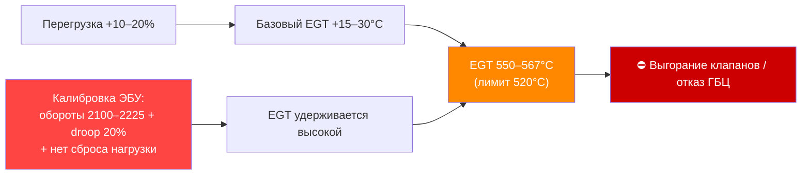

> [!map] Навигация
> [[#Роль фактора]] · [[#Данные Весовая]] · [[#Данные ГЕ Event 635]] · [[#Синергия калибровка ЭБУ × перегрузка]] · [[#Почему 730E не ломается]] · [[#Связь с ремонтами]]

# Анализ нагрузок QSK50 — синергия калибровки ЭБУ и перегрузки

> [!warning] Исправление от 2026-06-26
> «TIB» переформулирован: по аутентичному экспорту Calterm ([[Calibration_Compare_730E_vs_NTE200 (Calterm)]]) **TIB = Trip Information Base** (учёт рейса, на впрыск не влияет). Роль коренного фактора здесь играет **калибровка ЭБУ** (топливный код `0WH95` + отключённые защиты + повышенные обороты/droop), а не TIB.

> [!summary] Кратко
> Систематическая перегрузка — **усиливающий фактор**, а не коренная причина. Она повышает базовую EGT,
> а калибровка ЭБУ NTE200 (повышенные обороты/droop + отсутствие сброса нагрузки) удерживает EGT за лимитом Cummins 520°C.
> Коренная причина — [[Анализ коренных причин ГБЦ QSK50|калибровка ЭБУ NTE200]].

## Роль фактора



## Данные Весовая

Источник: [[verify_load_stats|система взвешивания БЕЛАЗ]] (поле `LoadPercentage`).

| Показатель | Значение |
|------------|----------|
| Файлов проанализировано | 131 |
| Машин | 50 (гар. №43–92) |
| Рейсов | **365 069** |
| Рейсов с перегрузкой (>100%) | **264 394 (72,4%)** |
| Средняя нагрузка | 102–108% |
| Макс. нагрузка (#84) | **134%** (~295 т в 220-тонном самосвале) |

### Лидеры по перегрузке

| Машина | Рейсов | % >100% | Средн. | Макс. |
|--------|--------|---------|--------|-------|
| [[Реестр машин NTE200\|#84]] | 8 742 | 93,9% | 108,4% | 134% |
| #56 | 6 308 | 91,7% | 107,2% | 120% |
| #44 | 10 818 | 90,9% | 106,3% | 121% |
| #43 | 10 425 | 81,7% | 104,6% | 125% |

## Данные ГЕ (Event 635)

Источник: [[Анализ нагрузок QSK50|события бортовой системы]]. Event 635 = перегрузка.

| Показатель | Значение |
|------------|----------|
| Файлов | 108 |
| Машин | 47 |
| События Event 635 по флоту | **26 677** |
| Машин с перегрузкой | **46 из 47** |

> [!note] Два независимых источника
> Весовая (рейсы) и ГЕ (события) подтверждают перегрузку **разными методами** — это повышает надёжность вывода.

## Синергия калибровка ЭБУ × перегрузка

```
Перегрузка +10–20%        → базовый EGT +15–30°C
Калибровка ЭБУ NTE200     → обороты 2100–2225, droop 20%, нет сброса нагрузки при перегреве
Итог                      → EGT стабильно 550–567°C при лимите 520°C
```

Перегрузка одна по себе не объясняет отказы (730E перегружаются так же — см. ниже).
Только в комбинации с калибровкой ЭБУ NTE200 возникает хронический перегрев.

## Почему 730E не ломается

| Фактор | NTE200 | 730E-DC |
|--------|--------|---------|
| Топл. код (карта впрыска) | 0WH95 | FC0BU52 |
| Дерейт по T масла | **отключён** | включён |
| Макс. обороты | 2100 (до 2225) | 1990 |
| Пиковая EGT | 550–567°C (хронически) | ~540°C (кратковременно) |
| Отказы ГБЦ | 12 случаев | **0** |

> [!check] Вывод
> При сопоставимой перегрузке разница — в калибровке ЭБУ (карта впрыска + защиты + обороты). 730E с включёнными защитами остаётся в пределах допуска.
> → подтверждает, что коренная причина — калибровка ЭБУ, а перегрузка лишь усиливает её.

## Связь с ремонтами

- [[Износ клапанов ГБЦ QSK50]] — реестр ремонтов
- Открытый шаг: сопоставить хронологию Event 635 по машинам с датами ремонтов ГБЦ.

## Следующие шаги

- [ ] Получить Весовая-данные по 730E для прямого сравнения нагрузки #действие/важно
- [ ] Сопоставить Event 635 по машинам с историей ремонтов ГБЦ #действие/важно
- [ ] Ввести ограничение нагрузки 95% в BMS БЕЛАЗ #действие/плановое
