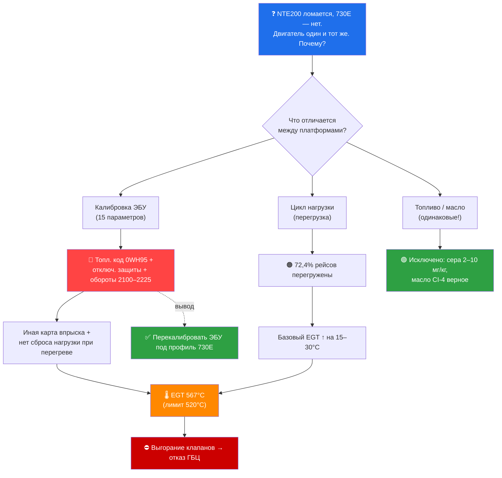
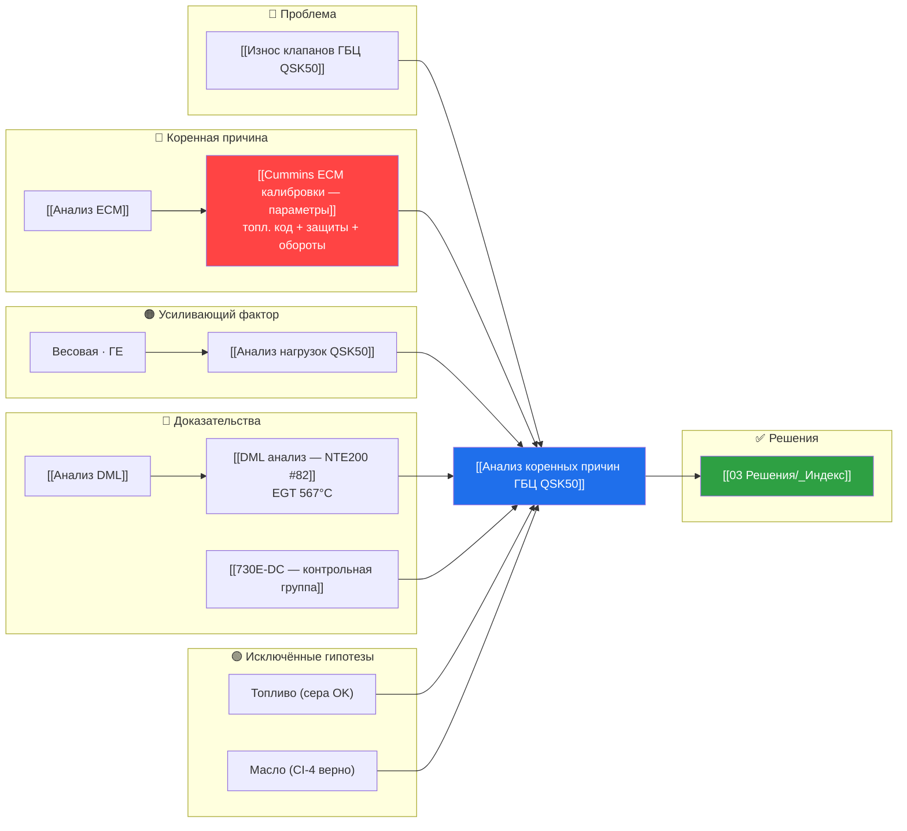
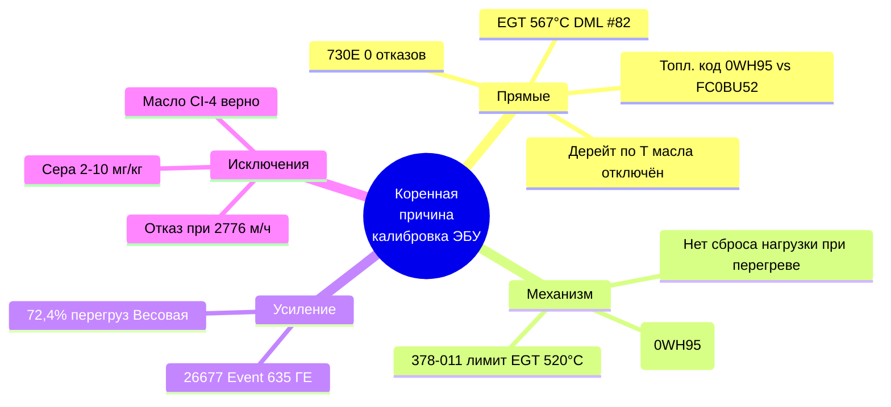
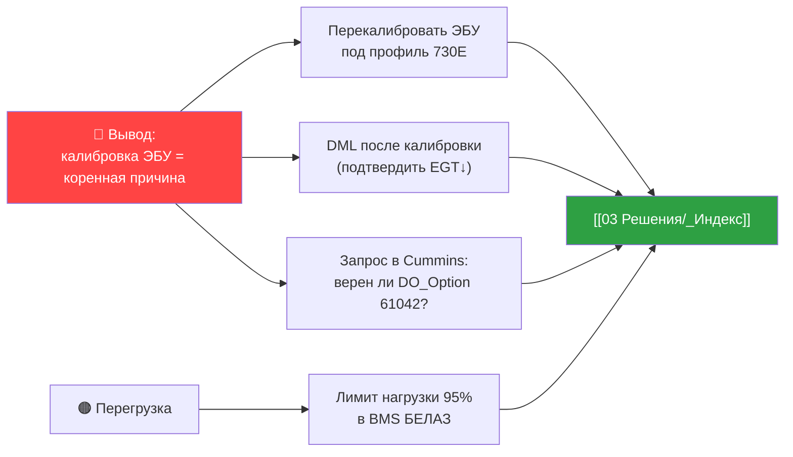

> [!abstract] Что это
> **Думающая модель** — карта рассуждения всего расследования: как от симптома (отказы ГБЦ) логика
> приводит к коренной причине (**калибровка ЭБУ NTE200**), какие гипотезы проверены и отброшены, на каких данных стоит вывод.
> Это центральный узел графа: отсюда расходятся ссылки на все ключевые заметки.

> [!warning] Исправление от 2026-06-26
> Прежняя редакция указывала коренной причиной «TIB=200%». По аутентичному экспорту Calterm ([[Calibration_Compare_730E_vs_NTE200 (Calterm)]]) **TIB = Trip Information Base** (учёт рейса/расхода, на впрыск не влияет). Коренная причина переформулирована как **кластер калибровки ЭБУ**: топливный код `0WH95` (карта впрыска) + отключённые/задержанные тепловые защиты + повышенные обороты/droop.

> [!map] Быстрая навигация
> [[#1 · Цепочка рассуждения]] · [[#2 · Полная карта связей]] · [[#3 · Дерево гипотез]] · [[#4 · Доказательная база]] · [[#5 · Узлы знаний]] · [[#6 · От вывода к действию]]

---

## 1 · Цепочка рассуждения

> [!question] Главный вопрос
> Почему ГБЦ/клапаны массово выходят из строя на **NTE200**, но **730E-DC** с тем же двигателем QSK50 на том же руднике работают без отказов?

> [!tip] Логика вывода (контрольная группа как «естественный эксперимент»)
> 730E и NTE200 различаются по ЭБУ, но **совпадают** по двигателю, топливу, маслу и руднику.
> Отказы только на NTE200 → причина в том, что различается → **калибровка ЭБУ** (топливный код + защиты + обороты).
> Перегрузка есть на обеих платформах → она усиливает, но не объясняет разницу.

---

## 2 · Полная карта связей

---

## 3 · Дерево гипотез

| # | Гипотеза | Проверка | Вердикт | Заметка |
|---|----------|----------|---------|---------|
| H1 | Калибровка ЭБУ (топл. код + защиты + обороты) | Аутентичный экспорт Calterm NTE200 vs 730E | ✅ **Подтверждена** | [[Calibration_Compare_730E_vs_NTE200 (Calterm)]] |
| H2 | Систематическая перегрузка | Весовая (365k рейсов) + ГЕ (Event 635) | 🟠 Усиливающий фактор | [[Анализ нагрузок QSK50]] |
| H3 | Качество топлива (сера) | 25 паспортов: 2–10 мг/кг | 🟢 Опровергнута | [[Анализ коренных причин ГБЦ QSK50#Анализ топлива]] |
| H4 | Неправильное масло (CJ-4) | Cummins 378-005: CI-4 верно для QSK50 без DPF | 🟢 Опровергнута | [[Анализ коренных причин ГБЦ QSK50#Анализ масел]] |
| H5 | Естественный износ | NTE#83 отказ при 2776 м/ч (новая машина) | 🟢 Опровергнута | [[Износ клапанов ГБЦ QSK50]] |

> [!check] Принцип отбора
> Гипотеза остаётся, только если она **различает** NTE200 и 730E. Топливо и масло одинаковы → не различают → отпадают.
> Калибровка ЭБУ (топливный код впрыска + тепловые защиты + обороты) различается и механистически связана с EGT → принимается.

---

## 4 · Доказательная база

| Вес | Доказательство | Источник |
|-----|---------------|----------|
| 🔴 | Топл. код 0WH95 + отключён дерейт по T масла | [[Calibration_Compare_730E_vs_NTE200 (Calterm)]] |
| 🔴 | EGT 567°C (цил. 2, 6) | [[DML анализ — NTE200 #82]] |
| 🔴 | 730E — 0 отказов | [[730E-DC — контрольная группа]] |
| 🟠 | 72,4% рейсов перегружены | [[Анализ нагрузок QSK50]] |
| 🟢 | Топливо/масло исключены | [[Анализ коренных причин ГБЦ QSK50]] |

---

## 5 · Узлы знаний

> [!info] Карты по разделам (MOC)
> - 🛑 [[01 Проблемы/_Индекс|Проблемы]] → [[Износ клапанов ГБЦ QSK50]]
> - 🔬 [[02 Диагностика/_Индекс|Диагностика]] → [[Анализ коренных причин ГБЦ QSK50]] · [[Анализ нагрузок QSK50]] · [[Анализ ECM]] · [[Анализ DML]]
> - ✅ [[03 Решения/_Индекс|Решения]]
> - 📚 [[04 Документация/_Индекс|Документация]] → [[04 Документация/Cummins/_Индекс|Cummins]]
> - 📊 [[05 Отчёты/_Индекс|Отчёты]]
> - 🤝 [[06 Встречи/_Индекс|Встречи]]
> - 🔧 [[07 Компоненты/_Индекс|Компоненты]] → [[QSK50 MCRS — техническое описание]] · [[Реестр машин NTE200]] · [[Реестр машин 730E]]
> - 🗄 [[_Данные/_Индекс|Данные]] → [[_Данные/ECM/_Индекс|ECM]] · [[_Данные/Весовая/_Индекс|Весовая]] · [[_Данные/ГЕ/_Индекс|ГЕ]] · [[_Данные/DML NTE200/_Индекс|DML]]

### Ключевые сущности

| Сущность | Значение | Узел |
|----------|----------|------|
| Двигатель | Cummins QSK50 MCRS, V16, 2500 л.с. | [[QSK50 MCRS — техническое описание]] |
| Платформа отказа | БЕЛАЗ-7513 NTE200 | [[Реестр машин NTE200]] |
| Контрольная группа | БЕЛАЗ-7513 730E-DC | [[730E-DC — контрольная группа]] |
| Узел отказа | ГРМ / клапаны / ГБЦ | [[ГРМ]] |
| Параметр-причина | Топл. код 0WH95 + отключ. защиты + обороты | [[Cummins ECM калибровки — параметры]] |

---

## 6 · От вывода к действию

### Приоритетные действия

- [ ] Перекалибровать ЭБУ NTE200 под профиль 730E (топл. код + защиты + обороты) #действие/срочно
- [ ] DML на парке после калибровки — подтвердить снижение EGT #действие/срочно
- [ ] Запрос в Cummins по DO_Option 61042 #действие/важно
- [ ] Ограничение нагрузки 95% в BMS БЕЛАЗ #действие/важно
- [ ] Сопоставить Event 635 с историей ремонтов ГБЦ #действие/важно

---

## Открытые вопросы расследования

> [!question] Что ещё нужно
> 1. Весовая-данные по 730E для прямого сравнения нагрузки.
> 2. Хронология Event 635 ↔ даты ремонтов ГБЦ.
> 3. Event 89 (RPM mismatch) — возможная связь с повышенными оборотами/droop.
> 4. Данные ГЕ/Весовая за 2023–2024 (до первых поломок).

---

*Центральный узел расследования. Обновляется при появлении новых данных. → [[00 Главная]]*
