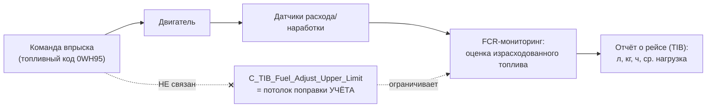

# TIB — что это на самом деле и влияет ли на впрыск

> [!danger] Исправление от 2026-06-26 (важно)
> Эта записка **переработана** после получения **аутентичного экспорта калибровок** (инструмент Calterm 4.7.1, прислан КАМСС, сравнение реальных контроллеров 730E vs NTE200).
> **TIB = Trip Information Base** (подсистема учёта рейса/наработки/расхода топлива), **а НЕ «Thermal Imbalance Balance/Compensation»**, как предполагалось в первой редакции. Параметр `C_TIB_Fuel_Adjust_Upper_Limit` (100→200 %) **НЕ управляет впрыском** — это предел поправки в учёте расхода топлива (FCR). Прежний вывод «TIB усиливает переобогащение и перегрев клапанов» **снят как ошибочный**. Ниже — корректная картина и что осталось в силе.

---

## 1. Что такое TIB на самом деле

В реальной калибровке группа называется буквально:

```
Group: TIB ---- Trip Information Base
```

**TIB = Trip Information Base** — штатная подсистема ЭБУ Cummins для **учёта и телеметрии рейса/наработки**: аналог «бортового счётчика». Это **read-only данные**, которые ничем не управляют, только накапливаются:

- `T_TIB_Trip_*` / `T_TIB_Total_*` — топливо, время работы, наработка, средние нагрузка/обороты/мощность за рейс и за весь срок службы;
- `T_TIB_*_Derate_Time`, `*_RPM_Derate_Fuel_Used` — учёт времени и топлива, пришедшихся на дерейты;
- `T_TIB_FCR_*` — мониторинг расхода топлива (Fuel Consumption Rate);
- `TI_Base_*` — вычисленные средние/итоги, выдаваемые во внешнюю телеметрию.

Сопроводительный текст в калибровке прямо говорит: *«This value should really be considered private power-down data»* — это **сохраняемая при выключении статистика**, а не контур регулирования.

> [!info] Вывод по сути
> TIB — это **отчётность о рейсе/наработке** (Trip Information Report), а не алгоритм управления двигателем. Никакого «теплового баланса цилиндров» в этой группе нет.

---

## 2. Спорный параметр `C_TIB_Fuel_Adjust_Upper_Limit` — влияет ли на впрыск? НЕТ

| Параметр | 730E | NTE200 | Ед. | Комментарий из ЭБУ |
|---|---|---|---|---|
| `C_TIB_Fuel_Adjust_Upper_Limit` | **100.000** | **200.000** | % | *«Upper Limit for Fuel Adjustment Factor»* |

**Где он физически находится** (это решает вопрос): внутри блока **TIB → FCR (Fuel Consumption Rate) monitoring**, между:
- `T_TIB_FCR_Volume_Fuel_Used` (накопленный объём топлива),
- `T_TIB_FCR_Mass_Fuel_Used` (накопленная масса топлива),
- `T_TIB_FCR_Engine_Run_Time` (время с включённым мониторингом расхода),
- `FCR_Short_Term_Log` (лог часовых средних расхода).

«Fuel Adjustment Factor» здесь — **поправочный коэффициент в подсистеме учёта/оценки расхода топлива** (согласование расчётного расхода с фактическим для отчётности и телеметрии). Параметр `..._Upper_Limit` — **верхний предел этого учётного коэффициента**.



> [!check] Вердикт по вашему вопросу
> `C_TIB_Fuel_Adjust_Upper_Limit` (100→200 %) **не влияет на впрыск топлива**. Это верхний предел поправочного коэффициента в **учёте расхода топлива (FCR)** внутри **Trip Information Base**. Изменение 100→200 % меняет максимально допустимую поправку при **расчёте/отображении израсходованного топлива** (отчётность, телеметрия), но **не команду форсункам и не цикловую подачу**.

**Признаки, что к впрыску он отношения не имеет:**
1. Он в группе **Trip Information Base / FCR** — это учёт, а не управление.
2. Во всём дифф-листе **нет ни одного параметра управления впрыском** (rail pressure, SOI / injection timing, fueling map, injector trim, cylinder balance отсутствуют).
3. Фактическая карта впрыска задаётся **топливным кодом** (`FC0BU52` → `0WH95`), а не параметром из TIB.

---

## 3. Что РЕАЛЬНО различает платформы (и влияет на тепловой режим)

Эти отличия подтверждены по строкам того же аутентичного экспорта — см. [[Calibration_Compare_730E_vs_NTE200 (Calterm)]].

| Параметр | 730E | NTE200 | Влияние |
|---|---|---|---|
| `_Fuel_Code_Part_Number` | FC0BU52 | **0WH95** | 🔴 Иная карта впрыска (давление рампы, фазы, дымовой ограничитель) |
| `C_EPD_OT_RPM_Drt_En` | 1 (вкл) | **0 (выкл)** | 🔴 Дерейт по T масла отключён |
| `C_EPD_CP_TB_Time_To_Max_Trq_Drt` | 0 с | **51 с** | Задержка дерейта по давл. масла |
| `C_EPD_CT_TB_Time_To_Max_Trq_Drt` | 0 с | **43 с** | Задержка дерейта по ОЖ |
| `C_EPD_WIF_RPM_Thd` | 2000 | **0** | Порог дерейта по воде в топливе обнулён |
| `C_ABS_Max_Acctr_Speed` | 1990 | **2100** | Выше макс. обороты |
| `T_ABS_MaxRef_2/3` | 1990 | **2225,8** | Ещё выше потолок оборотов в позициях 2/3 |
| `C_ABS_DroopMax` | 0 % | **20 %** | Допуск колебаний оборотов |

> [!note] Куда «переехал» механизм впрыска
> Любые отличия **впрыска** между платформами зашиты в **топливном коде `0WH95`** (карты давления/фаз/дымового ограничителя), а не в «TIB». Носитель **теплового** механизма — **кластер сниженной защиты + повышенные обороты/droop**, который не даёт сбросить нагрузку при перегреве. TIB в этой цепи **не участвует**.

---

## 4. Что осталось в силе, а что снято

> [!check] Скорректированная позиция
> - ✅ **Остаётся:** коренная причина — **калибровка ЭБУ NTE200** (иной топливный код `0WH95` + кластер сниженной тепловой защиты + повышенные обороты/droop). EGT 567 °C (DML #82), контрольная группа 730E с 0 отказов, письменное признание Cummins об отключённой защите по T масла (`C_EPD_OT_RPM_Drt_En` = выкл) — **в силе**.
> - ❌ **Снято:** «TIB = Thermal Imbalance»; «TIB управляет поцилиндровым впрыском»; «TIB 200 % → переобогащение → перегрев клапанов»; TIB как отдельный «амплифицирующий фактор». Параметр `C_TIB_Fuel_Adjust_Upper_Limit` — учёт расхода топлива, не впрыск.
> - ⚠️ **Без изменений по достоверности:** банковая асимметрия и точная передаточная «калибровка → °C» по-прежнему требуют телеметрии и пилотной перекалибровки.

## 5. Как подтвердить (план верификации, скорректированный)

1. 🔴 **Пилотная перекалибровка** 2–3 машин под профиль 730E: топливный код/карта впрыска как у 730E, включить `C_EPD_OT_RPM_Drt_En` и триггеры `C_DO_01/07/08`, убрать задержки derate, снизить max обороты до 1990. Контрольный DML до/после → ΔEGT. (Решающий, дешёвый, обратимый.)
2. 🟠 **Запросить у Cummins** различие топливных кодов `FC0BU52` vs `0WH95` (рампа давления, фазы впрыска, дымовой ограничитель, карта наддува).
3. 🟠 **Заменить бракованные форсунки** на одной машине без смены калибровки → развести вклад форсунок и калибровки.
4. 🟢 TIB-телеметрию (`TI_Base_*`) использовать по назначению — для **учёта наработки/расхода**, не как диагностику впрыска.

---

## Связи
- [[Calibration_Compare_730E_vs_NTE200 (Calterm)]] — аутентичный первоисточник (расшифровка TIB, значения)
- [[ecm_params_NTE200_vs_730E]] · [[Cummins ECM калибровки — параметры]]
- [[Отчёт по тестам форсунок NTE200]] · [[Корреляция зазор клапанов и форсунки]]
- [[Анализ коренных причин ГБЦ QSK50]] · [[QSK50 MCRS — техническое описание]] · [[730E-DC — контрольная группа]]
- [[00 Отчёт — ТС и Надёжность NTE200 (master)]]
