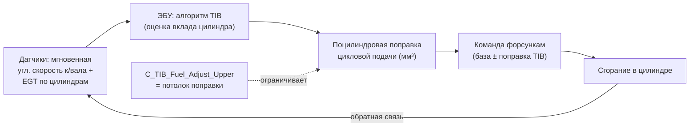
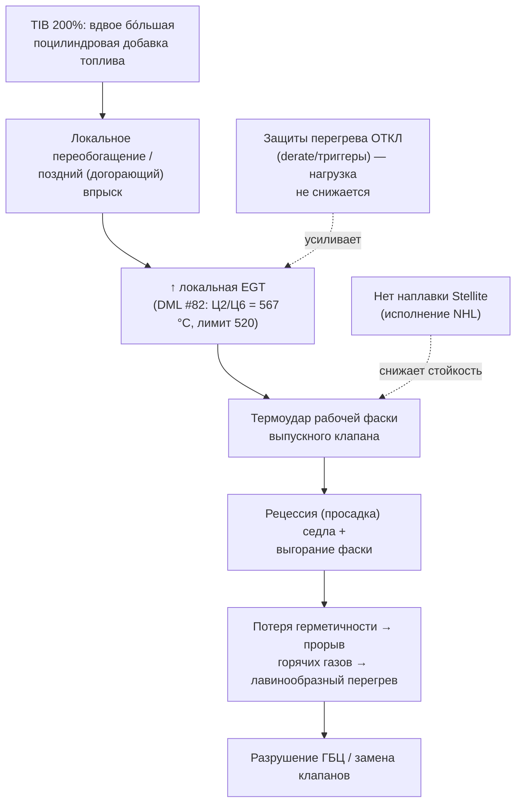

# Влияние TIB — расширенный технический анализ

> [!abstract] О документе
> Углублённый разбор параметра **TIB** (`C_TIB_Fuel_Adjust_Upper`) как **усиливающего (амплифицирующего)** фактора в многофакторной цепи отказов выпускных клапанов и ГБЦ Cummins QSK50 на самосвалах NTE200. Это **отдельная аналитическая записка** (по запросу — вне презентации). Все числовые значения параметров — из ECM-экспорта; внутренняя логика алгоритма Cummins проприетарна и где не подтверждена первоисточником, помечена как **инференс**.

---

## 1. Что такое TIB — определение и место в контуре управления

**TIB** — *Thermal Imbalance Balance* (в заметке [[QSK50 MCRS — техническое описание]] — *Thermal Imbalance Compensation*). Это **штатная функция замкнутого контура** ЭБУ Cummins (ECM) в системе **MCRS** (Modular Common Rail System), назначение которой — **выравнивать межцилиндровый дисбаланс** двигателя за счёт индивидуальной подстройки цикловой подачи топлива по каждому цилиндру (по каждой форсунке).

Физический смысл: ни один V16 не работает идеально симметрично. Разброс возникает из-за:
- допусков и износа форсунок (разная фактическая подача при одной команде);
- неравномерности наполнения цилиндров воздухом (геометрия впуска, наддув);
- разной компрессии/герметичности клапанов;
- теплового градиента по блоку (краевые и центральные цилиндры).

TIB **измеряет** косвенный признак вклада каждого цилиндра (по конвенции Cummins — через мгновенные колебания угловой скорости коленвала и/или сигналы EGT по цилиндрам; QSK50 оснащён поцилиндровыми термопарами EGT — см. DML) и **подстраивает** дозу впрыска, добавляя или убавляя топливо «слабым»/«сильным» цилиндрам, чтобы сравнять их вклад.

> [!info] Ключ
> `C_TIB_Fuel_Adjust_Upper` — это **не доза топлива**, а **верхний предел (потолок, saturation limit) полномочий алгоритма**: насколько сильно TIB вправе отклонить поцилиндровую подачу от базовой карты при попытке «сбалансировать» двигатель.

---

## 2. Что именно отличается на NTE200 (факт из ECM-экспорта)

| Параметр ЭБУ | 730E-DC | NTE200 | Ед. | Достоверность |
|---|---|---|---|---|
| `C_TIB_Fuel_Adjust_Upper` (верхний предел коррекции TIB) | **100** | **200** | % | ✅ ECM-экспорт `ECM_对比_NTE200_730E` |

**Интерпретация значения.** Полномочия TIB по подстройке топлива на NTE200 **удвоены**: алгоритму разрешено вдвое больше отклонять цикловую подачу отдельного цилиндра от базовой, чтобы «выровнять» двигатель. 730E ограничен 100%.

> [!warning] Важная оговорка по достоверности
> Подтверждено **значение потолка** (200 vs 100%). НЕ подтверждено логами **фактическое поцилиндровое отклонение топлива**, которое TIB реально применял в эксплуатации (телеметрии TIB-трима в выгрузках нет). Поэтому **величина** переобогащения в рейсе — **инференс по косвенным признакам** (EGT, банковая асимметрия, стендовые отклонения форсунок), а не прямое измерение. См. §9 (как подтвердить).

---

## 3. Почему «балансир» способен НАВРЕДИТЬ — парадокс TIB

На первый взгляд функция, которая *выравнивает* двигатель, не может перегревать клапаны. Разбор парадокса — суть анализа.

**3.1. TIB балансирует по вкладу/моменту, а не по температуре напрямую.**
Если критерий выравнивания — равный *крутящий вклад* (равная угловая «добавка» каждого цилиндра), то для цилиндра с **недоливающей** форсункой (низкая фактическая подача) TIB будет **наращивать команду** топлива, пытаясь догнать вклад до среднего. Реальная же форсунка может реагировать нелинейно: команда растёт, фактическая поздняя подача растёт быстрее → **локальное переобогащение и поздний догорающий впрыск** → **рост EGT именно в этом цилиндре**. Балансировка «по моменту» оборачивается **разбалансировкой по температуре**.

**3.2. Удвоенный потолок = удвоенная амплитуда ошибки.**
Любой контур с обратной связью при завышенном пределе насыщения склонен **перерегулировать** (overshoot) и «гоняться за шумом» датчиков. При 200% TIB может вносить вдвое большие поправки в ответ на тот же измеренный дисбаланс — то есть **усиливать** колебания подачи, а не гасить их, особенно когда исходный разброс форсунок велик (см. §5).

**3.3. Асимметрия «добавить vs убавить».**
Параметр назван *Upper* (верхний предел) — он нормирует, насколько TIB может **добавить** топлива. Если разрешение «добавлять» (200%) шире, чем фактически реализуемое «убавлять», итоговый баланс **смещается в сторону обогащения** суммарно по двигателю и точечно по «слабым» цилиндрам.

> [!danger] Суть
> На NTE200 TIB из инструмента *сглаживания* превращается в инструмент *амплификации*: вдвое большие поцилиндровые добавки топлива → локальные очаги переобогащения/позднего сгорания → точечный рост EGT.

---

## 4. Механизм отказа: цепь «TIB → EGT → клапан»

**Доказательная привязка каждого звена:**

| Звено цепи | Подтверждение | Источник | Статус |
|---|---|---|---|
| TIB 200% vs 100% | значение параметра | ECM-экспорт | ✅ факт |
| Переобогащение | перелив форсунок Тип А (1R/3R и др.) | стенд «Поток CR-2» | ✅ факт (по форсункам) |
| ↑ EGT до 567 °C | поцилиндровый замер | DML #82 | ⚠️ из анализа лог-файла |
| Тепловой дисбаланс банков | B-банк +60 °C к A | DML/ECM | ⚠️ из лога |
| Коды теплового дисбаланса | FC 628 «малое отклонение EGT» (#61), FC 611 «горячий стоп» ×46 машин | INSITE/ECM | ✅ факт (коды) |
| Термоудар/рецессия клапана | зазор выпускных 0,000 + ↑ высота (просадка) на #46/#87/#89 | дефектация KAMSS | ✅ факт (числа) |
| Снижена стойкость фаски | нет Stellite | письма NHL/Cummins | ✅ признано |

---

## 5. Синергия TIB × форсунки × отключённые защиты

TIB не действует в вакууме — он работает **поверх** двух других факторов, и именно их **сочетание** даёт отказ.

**5.1. TIB × разброс форсунок (топливный фактор).**
На #82 дефектны **9 из 16** форсунок: часть **переливает** (1R, 3R — Тип А), часть **недоливает** (2R, 8R — Тип Б). Это базовый аппаратный дисбаланс, который TIB обязан компенсировать. Но:
- по **недоливающим** цилиндрам TIB **добавляет** топливо → догоняет вклад → локальный перегрев;
- по **переливающим** — добавляется ещё и собственный избыток форсунки.

То есть **грязное топливо → износ плунжерных пар → разброс подачи** (инициирующий фактор по топливной системе) **создаёт работу для TIB**, а удвоенный потолок TIB **усиливает** последствия этого разброса. Два самых горячих цилиндра **Ц2 и Ц6 (567 °C)** — это форсунки **1R и 3R, обе с переливом** → пространственное совпадение «перелив ↔ горячий цилиндр» подтверждает связь (см. [[Отчёт по тестам форсунок NTE200]]).

> [!note] Объективная альтернатива (нельзя исключать)
> Возможно, потолок TIB подняли до 200% **намеренно** — как компенсацию заранее известного разброса форсунок/наддува на исполнении NTE200. Тогда TIB — не первопричина, а **симптом** топливно-форсуночной проблемы, одновременно являясь её **амплификатором**. Это не меняет вывода (TIB усиливает перегрев), но смещает «корень» к контаминации/форсункам. Подтвердить/опровергнуть можно только запросом обоснования калибровки у Cummins.

**5.2. TIB × отключённые защиты (почему нет «тормоза»).**
На 730E при перегреве срабатывают триггеры `C_DO_01/07/08` и снижение оборотов по T масла `C_EPD_OT_RPM_Drt_En` — двигатель **сбрасывает нагрузку**, и любой локальный перегрев от подачи **гасится**. На NTE200 **все эти защиты отключены**, а derate **задержан на 43–51 с**. Поэтому перегрев, спровоцированный поцилиндровой добавкой TIB, **не имеет обратного клапана**: EGT растёт и удерживается до термоудара. Cummins **письменно подтвердил**, что на NTE200 защита по T масла не снижает обороты — это прямое внешнее подтверждение нашей находки.

**Формула отказа:**
> **разброс форсунок (топливо)** задаёт дисбаланс → **TIB 200%** усиливает его поцилиндровыми добавками → **отключённые защиты** не дают сбросить нагрузку → **нет Stellite** снижает порог разрушения фаски → выгорание клапана.

---

## 6. Связь TIB с банковой асимметрией (B +60 °C)

DML #82 показывает: **банк B (чётные цилиндры) горячее банка A на ~60 °C**, и на B сосредоточено больше дефектных форсунок (6/8 против 3/8). Это согласуется с гипотезой TIB-дисбаланса: если корректирующая доза систематически смещена по одному банку (из-за разной геометрии наддува/возврата или из-за того, что «слабые» форсунки сгруппированы на B), то TIB **систематически переобогащает горячий банк**, усиливая уже существующий тепловой градиент. Это **позитивная обратная связь**, которой на 730E (TIB 100%, защиты вкл) нет.

> [!warning] Оговорка
> Банковая асимметрия измерена на **одной** машине (#82) и из лог-файла. Нужна выборка по нескольким NTE200 и сравнение с 730E, чтобы признак стал статистическим, а не единичным.

---

## 7. Количественная оценка (порядок величин, инференс)

Прямой передаточной функции «% TIB → °C EGT» в данных нет. Грубая оценка чувствительности — по доступным реперам:

- Без нагрузки EGT ~287 °C; под нагрузкой средняя ~474 °C; горячие цилиндры **567 °C** (DML #82).
- Рост max оборотов +110 (1990→2100) даёт, по оценке ECM-заметки, **+25–35 °C** EGT.
- Превышение лимита у Ц2/Ц6: **+47 °C** над 520 °C.

Качественный вывод: чтобы перевести цилиндр из «среднего» режима (~474 °C) в зону отказа (>520 °C), достаточно **локальной добавки топлива и/или запаздывания фазы**, дающей **+50…+90 °C**. Удвоенный потолок TIB (200%) делает такие поцилиндровые экскурсии **достижимыми и неконтролируемыми** (защиты отключены). Это **порядок-величины-аргумент**, а не точный расчёт — точные значения требуют стендовой передаточной характеристики QSK50.

---

## 8. Почему контрольная группа 730E не отказывает

730E-DC: **тот же двигатель QSK50, тот же объект, то же масло (CI-4), то же топливо**, но:
- TIB = **100%** (вдвое у́же полномочия поцилиндровой подстройки);
- защиты перегрева **включены**, derate **мгновенный**;
- max обороты **1990** vs 2100–2225.

Результат — **0 отказов ГБЦ**. Это **квази-эксперимент с контролем**: при прочих равных меняется калибровка ЭБУ (включая TIB), и меняется исход. Сильнейший аргумент в пользу того, что **калибровочный кластер (TIB + защиты)** — решающий усиливающий фактор.

> [!warning] Оговорка
> Нет полного реестра ремонтов 730E — «0 отказов» опирается на статус по DML/ECM, а не на сверенный журнал ремонтов. Форсунки 730E на стенде не испытывались — прямого сравнения разброса подачи нет.

---

## 9. Как подтвердить роль TIB (план верификации)

Чтобы перевести вывод из «инференс» в «доказано», нужно (по приоритету):

1. **Снять телеметрию TIB-трима из INSITE/CENSE**: фактические поцилиндровые поправки подачи (мм³ или %) на NTE200 в рейсе с породой. Покажет реальную амплитуду и привязку к горячим цилиндрам. 🔴
2. **Пилотная перекалибровка**: на 2–3 машинах выставить `C_TIB_Fuel_Adjust_Upper = 100`, включить `C_EPD_OT_RPM_Drt_En` и триггеры `C_DO_01/07/08`, снизить max обороты до 1990. **Контрольный DML** до/после → измерить ΔEGT и исчезновение пиков 567 °C. 🔴 (решающий тест)
3. **Развести вклад TIB и форсунок**: на одной машине заменить бракованные форсунки **без** смены калибровки → если EGT падает мало, доминирует TIB; если сильно — доминирует разброс форсунок. 🟠
4. **Запросить у Cummins обоснование** значения 200% для NTE200 (намеренная компенсация vs ошибка калибровки) и логику метрики TIB (момент vs EGT). 🟠
5. **Расширить выборку DML** по нескольким NTE200 и 730E → подтвердить банковую асимметрию статистически. 🟠

---

## 10. Итоговая позиция (объективно)

> [!check] Роль TIB в отказах — вывод
> 1. **TIB = усиливающий (амплифицирующий) фактор**, а не единственная первопричина. Первопричина — **многофакторная**: контаминация (пыль/впуск + грязное топливо) инициирует износ направляющих/стержней клапанов и разброс форсунок; **TIB 200% усиливает** тепловые последствия этого разброса; **отключённые защиты** не дают сбросить нагрузку; **отсутствие Stellite** снижает порог разрушения фаски.
> 2. **Подтверждено фактом**: значение `C_TIB_Fuel_Adjust_Upper` = 200% (NTE200) vs 100% (730E); перелив форсунок на горячих цилиндрах; коды теплового дисбаланса (FC 628/611); числовая рецессия клапанов (#46/#87/#89); письменное признание Cummins об отключённой защите по T масла.
> 3. **Не подтверждено прямым измерением** (инференс): фактическая амплитуда TIB-трима в рейсе; точная передаточная «% TIB → °C»; направленность асимметрии «добавить vs убавить»; намеренность значения 200%.
> 4. **Решающий тест** — пилотная перекалибровка на профиль 730E (TIB 100% + защиты вкл) с контрольным DML. Дёшев, обратим, устраняет корень без замены узлов.

---

## Связи
- [[ecm_params_NTE200_vs_730E]] — 15 параметров калибровки (источник значения TIB)
- [[Отчёт по тестам форсунок NTE200]] — разброс форсунок, перелив 1R/3R ↔ Ц2/Ц6 567 °C
- [[Корреляция зазор клапанов и форсунки]] — рецессия седла, числа #46/#87/#89
- [[Анализ коренных причин ГБЦ QSK50]] · [[QSK50 MCRS — техническое описание]] · [[730E-DC — контрольная группа]]
- [[00 Отчёт — ТС и Надёжность NTE200 (master)]] — главный аналитический документ
