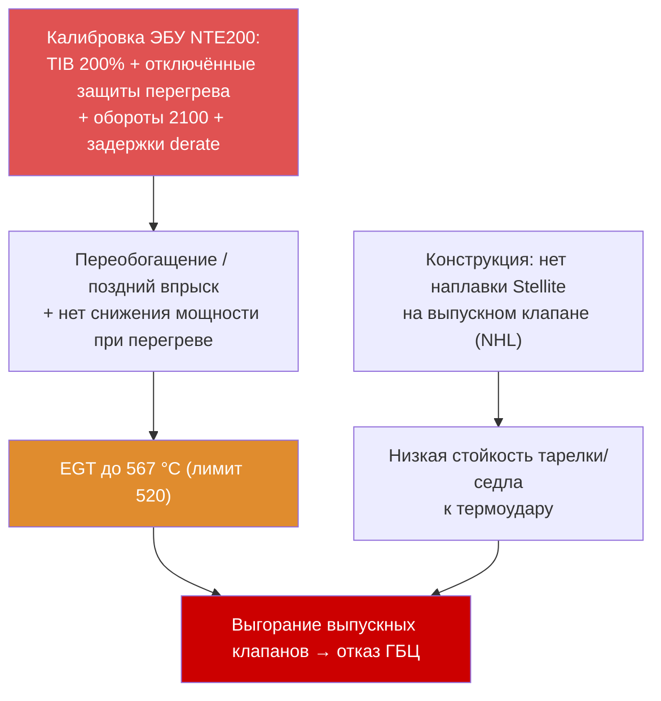

> [!abstract] О документе
> Объективный отчёт о массовых отказах головок блока (ГБЦ) и клапанного механизма двигателей **Cummins QSK50** на карьерных самосвалах **NTE200 (номинал 180 т**, NHL/North Hauler, электропривод GE; рудник Полюс Магадан). Контрольная группа — **730E-DC** (тот же двигатель, тот же объект, отказов ГБЦ нет).
> Все числа — из первичных данных песочницы. Легенда достоверности: ✅ подтверждено из первоисточника · ⚠️ заявлено в заметке · ❌ противоречиво/не подтверждено.

> [!map] Навигация
> [[#Резюме]] · [[#Часть I — Техническая служба]] · [[#Часть II — Отдел надёжности]] · [[#Достоверность и пробелы данных]] · [[#Рекомендации]]

# Отчёт ТС и отдела надёжности — отказы ГБЦ QSK50 на NTE200

## Резюме

> [!danger] Главный вывод
> Коренная причина — **системное снижение тепловой защиты в калибровке ЭБУ NTE200** относительно 730E-DC (15 отличающихся параметров): удвоенный верхний предел коррекции топлива **TIB (200% vs 100%)**, **отключённые триггеры перегрева** (масло/ОЖ/наддув/топливо), задержки снижения мощности 43–51 с и повышенные обороты (2100 vs 1990 об/мин). Это подтверждено прошивками ЭБУ и письмом Cummins.
> **Усугубляющий конструктивный фактор** — отсутствие наплавки **Stellite** на тарелке выпускного клапана (исполнение NHL), что признано и NHL, и Cummins.

| Фактор | Вердикт | Основание |
|---|---|---|
| Калибровка ЭБУ (TIB + отключённые защиты) | 🔴 Коренная причина | [[ecm_params_NTE200_vs_730E]] ✅ |
| Отсутствие Stellite (клапан NHL) | 🟠 Вторичный (конструктивный) | Письма NHL/Cummins ✅ |
| EGT выше лимита | 🔴 Прямое доказательство | DML #82: 567 °C (лимит 520) |
| Систематическая перегрузка | 🟢 **Не подтверждена** | 10/10/20 соблюдается ([[verify_load_stats]]) ✅ |
| Марка масла | 🟢 Не дифференцирует | Одинакова с 730E ([[oil_brands_NTE200_730E]]) ✅ |
| Абразивный/зольный износ (версия NHL) | 🟢 Опровергнут | Низкая сажа (0,3) и низкий Fe в масле ([[Масло ДВС — расширенный анализ NTE200 730E]]) ✅ |
| Топливо (сера) | 🟢 Исключено | Е5, 2–10 мг/кг |

---

## Часть I — Техническая служба

### 1. Объект и парк
- Техника: карьерный самосвал **NTE200**, номинал **180 т**, двигатель Cummins QSK50 MCRS (V16, Tier 2, без DPF/EGR), электропривод GE.
- Контрольная группа: **730E-DC** (тот же двигатель QSK50, тот же рудник).
- В анализе ECM — снимки по 38 машинам; статус: **Отказ 10 · EGT/связан. 10 · Норма 17 · Катастроф. 1** ([[ecm_machine_status]]). 21 из 38 (55%) — в отказном/EGT-статусе.

### 2. Реестр отказов ГБЦ/клапанов
Подтверждённые ремонтные события (источники: техотчёты, ECM-статус). См. [[Износ клапанов ГБЦ QSK50]].

| Маш | Дата | Наработка | Операция |
|---|---|---|---|
| #51 | 17.07.2025 | ~10 783 | Замена ГБЦ (трещина → ОЖ в масло) |
| #58 | 10.08.2025 | ~10 702 | Клапан/седло + толкатель |
| #47 | 11.08 / 07.12.2025 ❌ | ~12 890 | Замена ГБЦ (даты расходятся — см. достоверность) |
| #48 | 23.11 / 17.12.2025 ❌ | ~14 997 | Замена ГБЦ |
| #43 | 21.01.2026 | — | Клапаны + форсунки |
| #83 | ~03.2026 | **2 776** | Замена ГБЦ (ранний отказ, «Катастроф.») |
| #48 | 31.03.2026 | ~15 126 | Повторный ремонт |
| #58 | 16.03.2026 | — | Повторный ремонт клапана |
| #78 | 20.05.2026 | — | Клапаны |
| #55 | 13.05.2026 | — | Клапаны |
| #69 | 25.05.2026 | — | Клапаны |
| #54 | 12.06.2026 | — | Клапаны (новый техотчёт) |
| #89 | 12.06.2026 | — | Клапаны (новый техотчёт) |
| #77 | 16.06.2026 | — | Втулка (новый техотчёт) |
| #87 | 18.06.2026 | — | Клапаны (новый техотчёт) |

> Всего ~15 машин / ~17 событий (с повторами на #48, #58; добавлены #54, #77, #87, #89 по техотчётам 06.2026). Прежняя оценка «30 событий/24+ ед.» ❌ не подтверждается. План-график ремонта ГБЦ — в `03 Решения`.

### 3. Полевая диагностика
Эндоскопия и дефектовка: выгорание тарелок и сёдел выпускных клапанов, зольные/сажевые отложения; тесты ГБЦ (#46, #73 L2/R1), форсунки (#43). Лаб. анализ NHL: наплавка Stellite на тарелке **отсутствует по чертежу**.

### 4. DML — лог-файлы движения (двигатель)
Источник: [[Анализ DML]], [[DML анализ — NTE200 #82]]. Машина #82, рейс с породой:
- **EGT цил. 2 и 6 = 567 °C** при лимите Cummins 520 °C (+47 °C). ⚠️ значения из анализа лог-файла.
- Банковая асимметрия: банк B горячее банка A на **~60 °C** — признак дисбаланса корректирующей дозы (TIB).
- Датчик EGT цил. 11 ≈ 98 °C (FC1531) — обрыв термопары, индикатор обгоревшего клапана.
- Без нагрузки EGT ~287 °C, с нагрузкой ~474 °C средн. (рост +187 °C).

### 5. Ошибки ECM (Fault Codes)
Источник: [[ecm_faults]] (361 файл INSITE, 106 кодов).
- **FC 611 «Остановка горячего двигателя» — 46 машин** (массовые тепловые события).
- FC 146 «T ОЖ высокая», FC 197/235 «уровень ОЖ», FC 234 «высокие обороты» (Red).
- Активные: **#61 FC 628 «Малое отклонение EGT»** (тепловой дисбаланс), **#67 FC 1619 «датчик EGT цилиндра»**, **#51 FC 1549/323/1557 «цепи форсунок»**.

### 6. События GE-привода
Источник: [[_Данные/ГЕ/_Индекс]]. Event 635 (перегрузка) — 26 677 событий, 46/47 машин (интерпретация — в Части II с учётом 10/10/20). Event 89 (RPM mismatch) — требует подтверждения.

### 7. Топливо
25+ паспортов; сера 2–10 мг/кг (Е5, в 2,4× ниже порога Cummins 15 ppm). Нарушение: паспорт №246 (декларация ЕАЭС истекла 24.10.2025). **Топливо по сере исключено как причина.**

**Чистота топлива (ISO 4406)** — [[Анализ чистоты топлива ISO 4406]] (Дорингтест, июнь 2026, машины №46/47/81/82). Норма Cummins (бак) **18/16/13**; цель «вход в цилиндры» (Горная Евразия/Fleetguard) **12/9/6**. Факт после тонкой очистки: 17–21/13–18/12–17 — в 18/16/13 укладывается только №46, цель 12/9/6 **не достигается нигде**; грубый фильтр местами **ухудшает** чистоту. Топливо одно для NTE200 и 730E ⇒ **не дифференцирует** отказ, но загрязнение угрожает форсункам MCRS (зазоры 2–5 мкм; отказы форсунок #51/#47/#43) — отягчающий фактор по топливной системе.

### 8. Масло (расширенный анализ ДВС)
Источники: **`Свод_анализов_масла.xlsm`** (2025 и ранее) + **`Свод_анализов_масла 2026.xlsm`** (2026, обновляется). Только ДВС, дедуп, **период 2024-01 — 2026-07** (NTE200 — 1827 проб, 730E — 715). См. [[Масло ДВС — расширенный анализ NTE200 730E]], [[oil_NTE200]], [[oil_730E]].

**Использованные масла (ДВС):** NTE200 — **Газпромнефть G-Profi MSI Plus 15W-40** (1141) и **TEBOIL Super HPD Plus 15W-40** (670); 730E — те же + Komatsu/Mobil/Лукойл. Все — SAE 15W-40, тип Моторное (класс API CI-4). ⇒ марка/тип **не дифференцирует** парки.

**Технические показатели масла (медиана, ДВС):**

| Показатель | NTE200 | 730E | Норма | Статус |
|---|---|---|---|---|
| TBN (щёлочное), мгКОН | 9,7 | 9,5 | ≥2,5 | ✅ практически нет ниже нормы |
| Сажа (ST) | 0,3 | 0,4 | низкая | ✅ |
| Окисление (OXI) | 0,1 | 0,1 | низкое | ✅ |
| V100, cSt | 15,3 | 15,4 | 12,5–16,3 | ✅ |
| Вода / топливо | ~0 / ~0 | ~0 / ~0 | <0,1% / <5% | ✅ |
| Fe (износ) P95 | 6 | 16 | износ | низкий |

> [!check] Вывод по маслу
> Масло ДВС — в **отличном состоянии**: высокий TBN (9,7), **низкая сажа (0,3)**, нет окисления/разбавления, износ низкий. **Низкая сажа прямо опровергает версию NHL** про «поздний впрыск → сажа → зольный/абразивный износ клапанов». Отказ — термический; масло не является фактором и не дифференцирует NTE200 vs 730E. Бренды Газпромнефть и TEBOIL работают эквивалентно.

> [!tip] Интерактивная аналитика
> Полный разбор по машинам/узлам/параметрам (перцентили P50/P90/P95, тренды, критичные пробы, рейтинг износа) — офлайн-дашборд [[Дашборд масла NTE200 730E.html]] (NTE200 + 730E, 2024–2026).

---

## Часть II — Отдел надёжности

### 9. Грузоподъёмность и политика 10/10/20
Источник: [[verify_load_stats]] (131 файл, 365 069 рейсов, пересчёт от 180 т).

| Метрика | Среднее | >100% | >110% | >120% | Макс |
|---|---|---|---|---|---|
| `FinalPayload`/180 т | 99,7% | 67,5% | 6,0% | 0,01% | 133% (239 т) |
| Родное `LoadPercentage` | 102,8% | 72,4% | 8,2% | 0,10% | 145% |

> [!check] Вывод по 10/10/20 (среднее ≤100% · ≤10% >110% · нет >120%)
> Парк **соответствует** политике (по 180 т — все три критерия; по родному полю — на грани).
> **Систематическая перегрузка как значимый фактор отказов не подтверждается.** Прежний тезис «макс 295 т / нарушены все критерии» был ошибкой (номинал брался 220 т вместо 180 т).

**Производительность:** 65,5 млн т перевезено; цикл 30,6 мин; гружёный пробег 4,32 км; 31 км/ч; TKPH(зад.) 1544; ~6 888 рейсов/машину.

### 10. Анализ всех отказов и возможных причин

| Возможная причина | За | Против | Вердикт |
|---|---|---|---|
| Калибровка ЭБУ (TIB + отключённые защиты) | 15 параметров ↓защиты; EGT 567 °C; FC611 ×46; асимметрия банков; письмо Cummins подтверждает | — | 🔴 Коренная |
| Отсутствие Stellite (NHL) | Признано NHL и Cummins; мировая практика — Stellite штатно | Само по себе при включённых защитах 730E не приводит к отказам | 🟠 Вторичный |
| Перегрузка | Event 635 фиксируется | 10/10/20 соблюдается; среднее ≈100% | 🟢 Не значима |
| Абразивный/зольный износ масла | Версия NHL; зольные отложения на клапане | Низкий Fe в масле; отказ термический | 🟢 Ослаблена |
| Марка/класс масла | — | Одинаково с 730E (CI-4) | 🟢 Не дифференцирует |
| Топливо (сера) | — | Е5, 2–10 мг/кг | 🟢 Исключено |
| Естественный износ | — | #83 отказ при 2 776 ч | 🟢 Исключён |

### 11. Версии коренной причины

> [!danger] Версия A (основная) — калибровка ЭБУ
> На NTE200 относительно 730E: TIB 200% (vs 100%); отключены C_EPD_OT_RPM_Drt_En и триггеры C_DO_01/07/08 (наддув/ОЖ/топливо); задержки derate 51 с (масло) и 43 с (ОЖ); max обороты 2100 (до 2225) vs 1990; droop 20% vs 0%; пороги горячего стопа ниже. Итог — хронический перегрев и термоудар клапанов. См. [[ecm_params_NTE200_vs_730E]].

> [!warning] Версия B (вторичная) — конструкция клапана
> Выпускной клапан исполнения NHL **без наплавки Stellite** (признано NHL и Cummins). Снижает стойкость к термоудару, но при включённых защитах 730E отказов нет ⇒ усугубляющий, не самостоятельный фактор.

### 12. Сравнение ЭБУ NTE200 vs 730E
Полная таблица 15 параметров — [[ecm_params_NTE200_vs_730E]]. Ядро: NTE200 **отключает все триггеры перегрева** и допускает более высокие обороты/нагрузку.

### 13. Оценка писем NHL и Cummins

| Тезис письма | Контраргумент (данные) | Вердикт |
|---|---|---|
| NHL: износ от зольности масла (SAPS) | Низкий Fe в масле; отказ термический; масло = как на 730E | ❌ смещает на эксплуатацию |
| NHL: пыль из карьера | В анализе Si подчинён; фильтрация исправна | ❌ переоценка |
| NHL: отсутствие Stellite «нормально для rated» | NTE200 работает с TIB 200% и EGT 567 °C — это не rated; Stellite штатно в мировой практике | ❌ ложный аргумент (факт признан) |
| NHL: регулировка клапанов на 1500 ч, далее 5000 ч | Мировая норма 8000–12000 ч; частая регулировка — косвенный признак проблемы | ⚠️ косвенное признание |
| Cummins: масло CES20078 достаточно | Проблема не в масле, а в калибровке | ❌ уход от корня |
| Cummins: на NTE200 защита по T масла не снижает обороты | ✅ **подтверждает нашу находку** (C_EPD_OT_RPM_Drt_En = выкл) | ✅ ключевое признание |
| Cummins: «не поставляет Stellite» | Факт; но не объясняет, почему исключён для NTE200 | ❌ уход от ответственности |

> [!check] Итог по письмам
> Оба автора **признают** ключевые факты (отсутствие Stellite, отключённую защиту по T масла на NTE200, наличие перегрева), но смещают причину на эксплуатацию (масло/пыль/регулировка). Данные песочницы поддерживают калибровку ЭБУ + конструкцию, а не эксплуатацию.

---

## Достоверность и пробелы данных

| Пункт | Статус |
|---|---|
| Даты ремонтов #47 (11.08 vs 07.12.2025), #48 (17.12 vs 23.11.2025) | ❌ расходятся между источниками |
| Счёт ремонтов («30/24+» vs ~13 событий) | ❌ прежняя оценка завышена |
| «0 отказов 730E» | ⚠️ нет полного реестра ремонтов 730E (есть статус по DML/ECM) |
| Цитаты Cummins 378-010/011 и лимит 520 °C | ⚠️ без дословного первоисточника |
| EGT 567 °C (#82 DML) vs 329 °C (#83 INSITE) | ⚠️ разные машины/условия |
| Прежний тоннаж (220 т, «295 т») | ❌ исправлено на 180 т (239 т) |
| Период проб масла | ✅ 2024-02 — 2025-12 (2026 в своде нет) |

---

## Рекомендации

### Немедленно 🔴
- [ ] Перекалибровать ЭБУ NTE200 под профиль 730E: TIB 100%, включить C_EPD_OT_RPM_Drt_En и триггеры C_DO_01/07/08, убрать задержки derate, снизить max обороты до 1990 #действие/срочно
- [ ] Контрольный DML на парке после перекалибровки — подтвердить снижение EGT #действие/срочно
- [ ] Заменить датчики EGT с FC1531/1619 (#82, #67) #действие/срочно

### Среднесрочно 🟠
- [ ] Запрос NHL/Cummins: обоснование исключения Stellite и отключения защит для NTE200; поставка клапанов с наплавкой #действие/важно
- [ ] Унифицировать прошивку ЭБУ (.07/.08) по парку #действие/важно
- [ ] Сопоставить FC611/EGT-коды с историей ремонтов по машинам #действие/важно

### Долгосрочно 🟡
- [ ] Мониторинг EGT и FC611 в реальном времени #действие/плановое
- [ ] Устранить нарушение по паспорту топлива №246 #действие/плановое

## Открытые вопросы
1. Почему на NTE200 отключены все триггеры перегрева и повышены обороты — заводская ошибка или намеренный профиль?
2. Полный реестр ремонтов 730E для строгого подтверждения «0 отказов».
3. Хронология Event 635/FC611 ↔ даты ремонтов.

## Связанные материалы
- [[Думающая модель — карта расследования]] · [[Анализ коренных причин ГБЦ QSK50]] · [[Анализ нагрузок QSK50]]
- Данные: [[verify_load_stats]] · [[ecm_params_NTE200_vs_730E]] · [[ecm_faults]] · [[ecm_machine_status]] · [[oil_brands_NTE200_730E]] · [[oil_NTE200]] · [[oil_730E]]

*АО «Развитие» · QSK50 / NTE200 · Полюс Магадан · 2026 · Конфиденциально*
