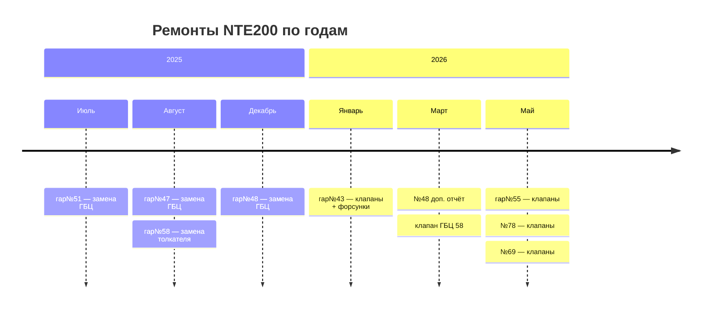

# NTE200 — Карта репозитория

#NTE200 #карта #MOC

> [!info] О репозитории
> Материалы по проекту **NTE200** — технические отчёты, данные мониторинга, анализ топлива и масла, тестирование узлов двигателя.

---

## Структура

```
NTE200/
├── техотчеты/          ← Технические отчёты по машинам
├── форсунки/           ← Форсунки: отчёты и тесты
├── гбц-клапаны/        ← ГБЦ, клапаны, цилиндры
├── тесты/              ← Тесты машин №46 и №73
├── данные/             ← CSV-рейсы, ECM, логи, архивы
├── топливо-масло/      ← Расход топлива, анализ масел
├── аналитика/          ← Сводные отчёты, дашборды, презентации
└── медиа/              ← Изображения
```

---

## 📁 техотчеты

#техотчет #ремонт

Технические отчёты по конкретным машинам (гаражный номер).

| Файл | Машина | Вид работ | Дата |
|------|--------|-----------|------|
| `ТЕХНИЧЕСКИЙ ОТЧЁТ NTE 200 ( гар№43 )...pdf` | гар№43 | Замена выпускных клапанов и форсунок | 21.01.2026 |
| `ТЕХНИЧЕСКИЙ ОТЧЁТ NTE 200 ( гар№47 )...pdf` | гар№47 | Замена ГБЦ | 11.08.2025 |
| `ТЕХНИЧЕСКИЙ ОТЧЁТ NTE 200 ( гар№48 )...pdf` | гар№48 | Замена ГБЦ | 17.12.2025 |
| `ТЕХНИЧЕСКИЙ ОТЧЁТ NTE 200 ( гар№51 )...docx` | гар№51 | Замена ГБЦ | 17.07.2025 |
| `ТЕХНИЧЕСКИЙ ОТЧЁТ NTE 200 ( гар№55 )...docx` | гар№55 | Замена клапанов | 13.05.2026 |
| `ТЕХНИЧЕСКИЙ ОТЧЁТ NTE 200 ( гар№58 )...docx` | гар№58 | Замена толкателя | 10.08.2025 |
| `69 ТЕХНИЧЕСКИЙ ОТЧЁТ NTE 200 клапанов...docx` | №69 | Замена клапанов | 25.05.2026 |
| `78 ТЕХНИЧЕСКИЙ ОТЧЁТ NTE 200 клапанов...docx` | №78 | Замена клапанов | 20.05.2026 |
| `Тех отчет 47.pdf` | №47 | — | — |
| `Тех отчет 48.pdf` | №48 | — | — |
| `Тех оточет 48 от 31.03.2026.pdf` | №48 | — | 31.03.2026 |
| `Тех отчет 55.pdf` | №55 | — | — |
| `Тех отчет 83 от 30.03.2026.pdf` | №83 | — | 30.03.2026 |
| `Тех отчет 92.pdf` | №92 | — | — |
| `Тех отчеты NTE.pdf` | Все | Сводный | — |
| `ГБЦ#55.pdf` | №55 | ГБЦ фото/документация | — |

> [!note] Машины с несколькими отчётами
> **гар№47** — 2 файла · **гар№48** — 3 файла · **гар№55** — 2 файла

---

## 📁 форсунки

#форсунки #двигатель

| Файл | Тип | Описание |
|------|-----|----------|
| `12. Форсунка ДВС - отчет.pdf` | PDF | Отчёт по форсунке ДВС |
| `924. Форсунка - отчет.pdf` | PDF | Отчёт по форсунке №924 |
| `Тест форсунок.7z` | Архив | Данные тестирования форсунок |

---

## 📁 гбц-клапаны

#ГБЦ #клапаны #цилиндры

| Файл | Тип | Описание |
|------|-----|----------|
| `58 клапан гбц 16.03.26.pdf` | PDF | Клапан ГБЦ, 16.03.2026 |
| `ГБЦ ремонты.xlsx` | Excel | Журнал ремонтов ГБЦ |
| `气门盘部磨损分析报告-1.docx RUS.pdf` | PDF | Анализ износа тарелок клапанов (перевод с кит.) |
| `qsk50_cylinders.zip` | Архив | Данные по цилиндрам QSK50 |

---

## 📁 тесты

#тесты #диагностика

### Машина №46 — 16 точек замера (8 цилиндров × L/R)

| № | Цилиндр | Сторона | Результат |
|---|---------|---------|-----------|
| 1 | 1 | L (левый) | `-` |
| 2 | 1 | R (правый) | `+` |
| 3 | 2 | L | `+-+-` |
| 4 | 2 | R | `--++` |
| 5 | 3 | L | `+-+-` |
| 6 | 3 | R | `+` |
| 7 | 4 | L | `+` |
| 8 | 4 | R | `-` |
| 9 | 5 | L | `+---` |
| 10 | 5 | R | `-++-` |
| 11 | 6 | L | `-++-` |
| 12 | 6 | R | `-+++` |
| 13 | 7 | L | `-` |
| 14 | 7 | R | `-+--` |
| 15 | 8 | L | `-+-+` |
| 16 | 8 | R | `-+-+` |

> [!tip] Расшифровка знаков
> `+` — положительный результат / норма · `-` — отклонение

### Машина №73

| Файл | Описание |
|------|----------|
| `Тест L2 №73.pdf` | Тест левый борт 2 |
| `Тест R1 №73.pdf` | Тест правый борт 1 |

---

## 📁 данные

#данные #телематика #ECM #DML

### CSV — рейсовые данные

| Файл | Машина | Описание |
|------|--------|----------|
| `DML-20260602-164606 82 без породы тест 3.csv` | №82 | Рейс без породы, тест 3 |
| `DML-20260602-171259 82 (тест 3 с породой).csv` | №82 | Рейс с породой, тест 3 |
| `DML-20260604-154912 46 рейс с породой.csv` | №46 | Рейс с породой |
| `DML-20260606-153327 Рейс с породой.csv` | — | Рейс с породой |
| `DML-20260608-NTE200#88.csv` | №88 | Рейс |
| `NTE200A N43 16.05.2026.csv` | №43 | Данные NTE200A |
| `NTE200A N84 16.05.2026.csv` | №84 | Данные NTE200A |
| `speed and production.csv` | Все | Скорость и производительность |

### Архивы с данными

| Файл | Описание |
|------|----------|
| `Данные GE.7z` | Данные GE (General Electric / двигатель) |
| `Данные с ECM.7z` | Данные с блока управления ECM |
| `Данные сняты под нагрузкой.7z` | Данные при нагрузке |
| `Payload NTE200.7z` | Данные о полезной нагрузке |
| `Log Files_NTE200.7z` | Логи NTE200 |
| `Log Files_730E.7z` | Логи 730E |
| `All Report 05_06_2026.7z` | Сводный отчёт 05.06.2026 |
| `Камсс.7z` | Данные КАМСС |
| `для_другого_ПК.zip` | Перенос данных на другой ПК |

---

## 📁 топливо-масло

#топливо #масло #анализ

| Файл | Тип | Описание |
|------|-----|----------|
| `NTE200_fuel.xlsx` | Excel | Расход топлива NTE200 |
| `730_fuel.xlsx` | Excel | Расход топлива 730E |
| `Свод_анализов_масла.xlsm` | Excel (макрос) | Свод анализов масла (актуальный) |
| `Свод_анализов_масла 21.05.xlsm` | Excel (макрос) | Свод анализов масла (версия от 21.05) |
| `Доливки Горная Евразия.xlsx` | Excel | Доливки масла — Горная Евразия |

> [!warning] Две версии свода масел
> `Свод_анализов_масла.xlsm` — актуальная версия
> `Свод_анализов_масла 21.05.xlsm` — предыдущая версия (май)

---

## 📁 аналитика

#аналитика #отчёт #презентация

| Файл | Тип | Описание |
|------|-----|----------|
| `ОТЧЕТ Полюс Магадан.xlsx` | Excel | Отчёт — Полюс Магадан |
| `1. ОТЧЕТ Полюс Магадан.xlsx` | Excel | Отчёт — Полюс Магадан (версия 1) |
| `Сводный_анализ_NTE_с_БЕ.xlsx` | Excel | Сводный анализ NTE с БЕ |
| `Сводный_анализ_NTE_с_БЕ 25_06_2026.xlsx` | Excel | Сводный анализ NTE с БЕ (25.06.2026) |
| `dashboard_final.html` | HTML | Интерактивный дашборд |
| `Анализ КТГ БЕЛАЗ-7513.pptx` | PowerPoint | Анализ КТГ БЕЛАЗ-7513 |
| `Развитие шаблон.pptx` | PowerPoint | Шаблон презентации «Развитие» |

---

## 📁 медиа

#фото

| Файл | Формат |
|------|--------|
| `AA92674C-D384-409B-9021-4364C2FE56A1.webp` | WebP |
| `581E1FA4-0633-4AD6-8EA2-72528F1B5B14.webp` | WebP |

---

## Машины в репозитории

```dataview
TABLE without id
  машина AS "Гар №",
  count AS "Файлов"
WHERE file = this.file
```

| Гар № | Упоминания в репозитории |
|-------|--------------------------|
| №43 | Тех. отчёт (клапаны + форсунки) · CSV NTE200A |
| №46 | 16 тестов цилиндров · CSV рейс с породой |
| №47 | 2 тех. отчёта (ГБЦ) |
| №48 | 3 тех. отчёта (ГБЦ) |
| №51 | Тех. отчёт (ГБЦ) |
| №55 | 2 тех. отчёта (клапаны) · ГБЦ#55 |
| №58 | Тех. отчёт (толкатель) · клапан ГБЦ |
| №69 | Тех. отчёт (клапаны) |
| №73 | 2 теста (L2/R1) |
| №78 | Тех. отчёт (клапаны) |
| №82 | CSV рейсы (с/без породы) |
| №83 | Тех. отчёт |
| №84 | CSV NTE200A |
| №88 | CSV рейс |
| №92 | Тех. отчёт |

---

## Хронология ремонтов



---

## Теги

| Тег | Раздел |
|-----|--------|
| `#техотчет` | техотчеты/ |
| `#форсунки` | форсунки/ |
| `#ГБЦ` `#клапаны` | гбц-клапаны/ |
| `#тесты` `#диагностика` | тесты/ |
| `#данные` `#ECM` `#DML` | данные/ |
| `#топливо` `#масло` | топливо-масло/ |
| `#аналитика` `#отчёт` | аналитика/ |
| `#NTE200` | весь репозиторий |
